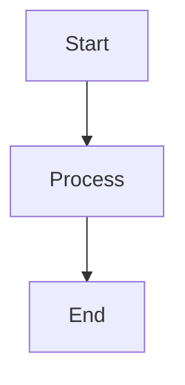

# GitHub Documentation Plugin for Kirby CMS

This plugin allows you to create virtual pages in Kirby CMS that display documentation directly from GitHub repositories. The content is fetched dynamically without storing it locally, and supports Mermaid diagrams.

## Features

- **Virtual Content**: Documentation pages are created dynamically from GitHub repositories
- **Real-time Sync**: Content is always fetched directly from GitHub (no local storage)
- **Mermaid Diagrams**: Full support for Mermaid diagram rendering
- **Image Processing**: Automatically converts relative image paths to GitHub raw URLs
- **Markdown Support**: Full GitHub-flavored markdown support with frontmatter
- **Admin Panel Integration**: Easy configuration through Kirby's admin panel
- **Caching**: Intelligent caching to improve performance and respect GitHub API limits

## Installation

1. Copy the `github-docs` folder to your `site/plugins/` directory
2. The plugin will be automatically loaded by Kirby

## Usage

### 1. Create a GitHub Documentation Page

1. In the Kirby admin panel, create a new page
2. Select the "GitHub Documentation" template
3. Configure the following settings:
   - **GitHub Repository URL**: The full GitHub repository URL (e.g., `https://github.com/owner/repo`)
   - **Branch**: The Git branch to read from (default: `main`)
   - **Documentation Path**: Path to the documentation folder in the repository (default: `docs`)
   - **GitHub API Token**: (Optional) Personal access token for private repositories or higher rate limits

### 2. Access Documentation

Once configured, the plugin will:
- Automatically discover all markdown files in the specified directory
- Create virtual sub-pages for each documentation file
- Display them in a navigable structure

### 3. Mermaid Diagrams

The plugin automatically detects and renders Mermaid diagrams. Simply use the standard markdown syntax:

```markdown

```

## Configuration Options

### Repository Settings
- **GitHub Repository URL**: Required. Full GitHub repository URL
- **Branch**: Git branch to read from (default: main)
- **Documentation Path**: Folder containing documentation (default: docs)
- **GitHub API Token**: Optional personal access token

### Display Settings
- **Auto Update**: Enable/disable automatic content fetching
- **Cache Duration**: How long to cache GitHub content (in hours)
- **Include Images**: Process and include images from the repository
- **Mermaid Support**: Enable Mermaid diagram rendering

## URL Structure

Documentation pages are accessible via:
```
/your-page-slug/github-docs/document-name
```

Where:
- `your-page-slug` is the slug of your GitHub Documentation page
- `document-name` is the filename (without `.md` extension) of the documentation file

## GitHub API Considerations

- **Rate Limits**: GitHub API has rate limits (60 requests/hour for unauthenticated requests, 5000/hour with token)
- **Private Repositories**: Require a personal access token
- **Caching**: The plugin caches responses to minimize API calls

## Frontmatter Support

The plugin supports YAML frontmatter in markdown files:

```markdown
---
title: Custom Page Title
description: Page description
author: John Doe
---

# Your content here
```

## Troubleshooting

### Common Issues

1. **"Unable to fetch documentation"**
   - Check that the repository URL is correct and public
   - Verify the documentation path exists
   - Ensure you have a GitHub API token if needed

2. **"No documentation files found"**
   - Verify the documentation path contains `.md` files
   - Check the branch name is correct

3. **Images not displaying**
   - Ensure "Include Images" is enabled
   - Check that image paths in markdown are relative to the documentation folder

### Debug Mode

Enable Kirby's debug mode in your `config.php`:
```php
return [
    'debug' => true
];
```

## Requirements

- Kirby CMS 3.x or higher
- PHP 7.4 or higher
- `curl` extension enabled (for GitHub API requests)

## License

This plugin is provided as-is for educational and development purposes.
