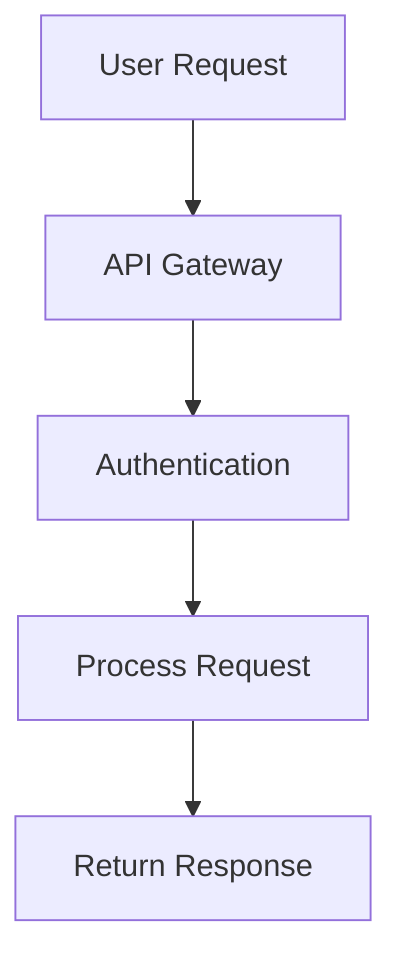

# Example GitHub Documentation Page

This is an example of how to set up a GitHub documentation page.

## Step 1: Create a new page

1. Go to your Kirby admin panel
2. Create a new page
3. Choose "GitHub Documentation" as the template

## Step 2: Configure the repository

Fill in the following fields:

- **Title**: "Project Documentation" (or whatever you prefer)
- **GitHub Repository URL**: `https://github.com/your-username/your-repo`
- **Branch**: `main` (or your default branch)
- **Documentation Path**: `docs` (or wherever your documentation is stored)

## Step 3: Optional settings

- **GitHub API Token**: Add a personal access token if you need higher rate limits or access to private repositories
- **Enable Mermaid**: Turn on if your documentation contains Mermaid diagrams
- **Cache Duration**: Set how long to cache the GitHub content (default: 24 hours)

## Example Repository Structure

Your GitHub repository should have a structure like this:

```
your-repo/
├── docs/
│   ├── getting-started.md
│   ├── api-reference.md
│   ├── configuration.md
│   └── troubleshooting.md
├── images/
│   └── diagram.png
└── README.md
```

## Example Documentation File

Here's an example of a documentation file with frontmatter:

```markdown
---
title: Getting Started Guide
description: A comprehensive guide to get you started
author: Your Name
---

# Getting Started

Welcome to our project! This guide will help you get started.

## Installation

First, install the required dependencies:

```bash
npm install
```

## Configuration

Create a configuration file:

```javascript
module.exports = {
  apiKey: 'your-api-key',
  baseUrl: 'https://api.example.com'
};
```

## Mermaid Diagram Example



## Images

You can include images using relative paths:


```

## Testing the Setup

Once configured:

1. Save your GitHub Documentation page
2. Visit the page on your website
3. You should see a list of all markdown files from your repository
4. Click on any file to view its rendered content
5. Mermaid diagrams should render automatically if enabled

## Troubleshooting

If you encounter issues:

1. Check that your repository is public (or you have a valid API token)
2. Verify the documentation path exists in your repository
3. Ensure markdown files have the `.md` extension
4. Check Kirby's error logs for detailed error messages
